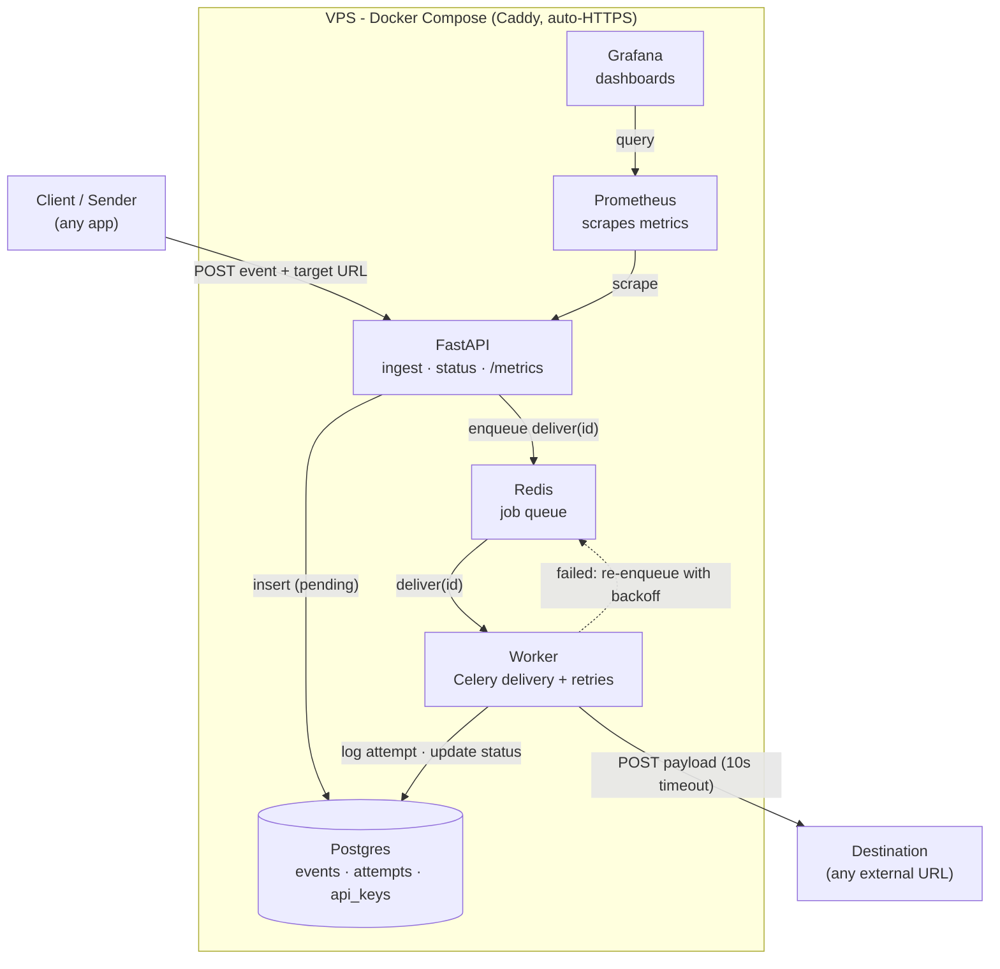
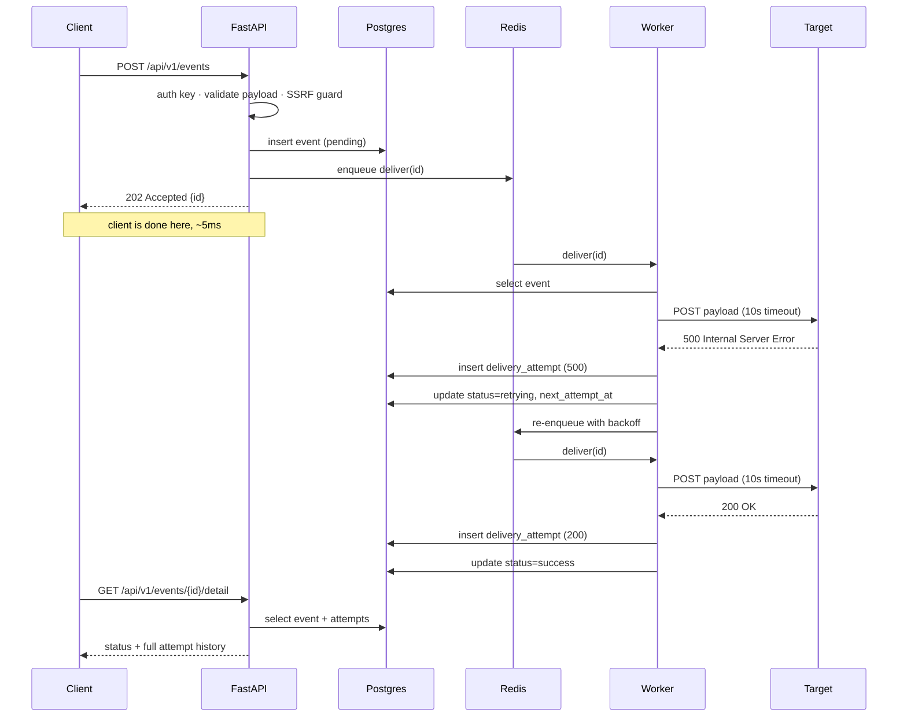
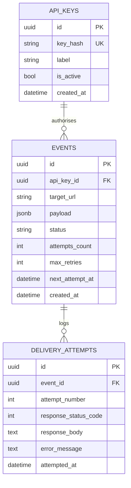

<p align="center">
  
</p>

<h1 align="center">hookline</h1>

<p align="center">
  A production-grade webhook delivery engine: durable queue, exponential-backoff retries,
  dead-lettering, and a full audit log of every attempt.
</p>

<p align="center">
  <a href="https://tryhookline.dev">Live demo</a> ·
  <a href="#architecture">Architecture</a> ·
  <a href="#how-it-works">How it works</a> ·
  <a href="#running-it-locally">Run it</a>
</p>

---

## What it does

A **webhook** is an HTTP POST that one service sends another when something happens - a payment
clears, a job finishes, a build completes. Sending it once is easy. Sending it *reliably* - when
the receiver is down, slow, or flaky - is the hard part, and it's the part most people
underestimate.

**hookline** takes ownership of that problem. You hand it an event; it guarantees the delivery
attempt, retries with backing-off delays when the target fails, gives up cleanly after a bounded
number of tries, and records every single attempt so you can prove what happened. The sender gets
a `202 Accepted` in milliseconds and never has to wait on the receiver.

There's a **live, interactive demo** at **[tryhookline.dev](https://tryhookline.dev)** - submit an
event and watch it move through the real pipeline, including the retry-then-dead-letter path.

## Architecture

hookline is an async FastAPI service backed by a Celery worker, with Postgres as the source of
truth and Redis as the job queue. The whole stack runs as Docker Compose on a single VPS, fronted
by Caddy for automatic HTTPS.



The **request lifecycle** - a delivery that fails once, then succeeds - is shown in detail here:



And the **data model** - three tables, an append-only attempt log per event:



## How it works

1. **Submit.** A client POSTs an event (target URL + JSON payload) to `POST /api/v1/events`. The
   request is authenticated with an API key and validated (payload size cap, well-formed URL).
2. **Guard.** Before anything is queued, the target is checked by an **SSRF guard** that resolves
   the hostname and rejects private, loopback, link-local, reserved, or multicast addresses -
   failing closed on anything it can't verify.
3. **Accept.** The event is written to Postgres as `pending`, a delivery job is enqueued on Redis,
   and the API returns `202 Accepted` immediately. The client is done in milliseconds; it never
   waits on the target.
4. **Deliver.** A Celery worker picks up the job and makes the HTTP POST to the target with a
   10-second timeout. Every attempt is recorded in `delivery_attempts` - status code, response
   body (truncated), error, and timing.
5. **Retry or finish.** On a 2xx the event is marked `success`. On failure it's scheduled for
   retry with **exponential backoff** (60s → 5m → 15m → 30m → 60m), and after a bounded number of
   attempts it's **dead-lettered** (`dead`) and left alone.
6. **Recover.** A Celery Beat scheduler polls Postgres every 60s for events due for retry - and
   for events whose in-flight claim was lost (worker crash, Redis flush), rescuing them after a
   grace window. The retry schedule lives in Postgres, not Redis, so **nothing is lost** if the
   broker is flushed.

## Design decisions

A few of the choices that shape the system (the full list lives in [`docs/decisions.md`](docs/decisions.md)):

- **Durable retries in Postgres, not Redis.** The retry schedule (`next_attempt_at`) is stored in
  Postgres and a poller re-enqueues due work. If Redis is flushed, no pending retry is lost - the
  poller recovers everything. Redis is treated as a disposable queue; Postgres is the source of
  truth.
- **Claim-before-enqueue, with lost-claim rescue.** The poller flips a due event to `queued` and
  commits *before* enqueuing, so a delivery can never start on an event whose claim isn't durable.
  A claim that's lost mid-flight is rescued by a later poll after a grace window - this is the
  "nothing is lost" guarantee.
- **SSRF guard on resolved IPs, fail-closed.** A public webhook sender is an SSRF machine. The guard
  resolves the hostname and checks the *actual IP* (not the string, which is trivially bypassed),
  and rejects on any uncertainty.
- **SHA-256 for API keys.** Keys are high-entropy random strings, so a fast hash is appropriate;
  only the hash is stored, so the raw key is unrecoverable by design and a DB breach exposes no
  usable credentials. (Slow hashes like bcrypt exist for low-entropy human passwords.)
- **Bounded I/O both directions.** Incoming payloads are capped at 256 KB (rejected at validation);
  stored response bodies are truncated. Prevents resource exhaustion from oversized data.
- **Sync worker, async API.** The API is async because it juggles many concurrent I/O-bound
  connections; the worker gets concurrency from Celery's process pool instead. Right concurrency
  model for each workload.

## Tech stack

**Core**
- **Python 3.12**
- **FastAPI** - async API framework
- **Celery** + **Celery Beat** - background delivery worker and scheduler
- **SQLAlchemy 2.0** (async) - ORM
- **Alembic** - database migrations
- **Pydantic** - request/response validation
- **httpx** - outbound HTTP delivery (with timeouts)

**Data & infrastructure**
- **PostgreSQL 16** - source of truth (events, attempts, API keys; JSONB payloads)
- **Redis 7** - job queue and per-IP rate-limit store
- **Docker** + **Docker Compose** - containerised stack
- **Caddy** - reverse proxy with automatic Let's Encrypt HTTPS

**Observability & ops**
- **prometheus-client** + **Prometheus** - metrics
- **Grafana** - dashboards
- **UptimeRobot** - external uptime monitoring
- nightly **pg_dump** backups

**Testing & CI**
- **pytest** + **pytest-asyncio** - test suite against a real Postgres test database
- **GitHub Actions** - runs the suite on every push and gates deployment on it

**Hosting**
- **Hetzner** VPS · **Cloudflare** DNS

## Running it locally

Requires Docker and Docker Compose.

```bash
git clone https://github.com/tktony/hookline.git
cd hookline

# create your env file from the template and fill in values
cp .env.example .env

# build and start the stack
docker compose up -d --build

# run database migrations
docker compose run --rm api alembic upgrade head

# mint an API key (prints the raw key once - save it)
docker compose exec api python -m app.cli create-key --label "local-dev"
```

The API is then reachable inside the stack; add a local port mapping if you want to hit it directly,
or use the interactive docs at `/docs`.

Submit an event:

```bash
curl -X POST http://localhost:8000/api/v1/events \
  -H "Content-Type: application/json" \
  -H "Authorization: Bearer YOUR_KEY" \
  -d '{"target_url": "https://webhook.site/your-url", "payload": {"hello": "world"}}'
```

## Testing

The suite runs against a real Postgres test database (async fixtures, per-test create/drop),
mocking outbound HTTP, DNS, and the Celery dispatch so tests exercise application logic rather than
the network.

```bash
# create the test database once
docker compose exec db psql -U hookline -c "CREATE DATABASE hookline_test;"

# run the suite inside the api container
docker compose exec api pytest -v
```

CI runs the same suite on every push (with throwaway Postgres and Redis services) and **only
deploys if the tests pass**.

## Deployment

The stack deploys as Docker Compose on a single VPS behind Caddy. Pushing to `main` triggers a
GitHub Actions workflow that runs the test suite, then SSHes into the server, pulls, rebuilds, and
applies migrations. Grafana is bound to localhost and reached over an SSH tunnel; Prometheus is
internal-only; the database and Redis are never exposed publicly.

## Future work

Things a larger-scale or multi-tenant deployment would add, deliberately left out here:

- **Idempotency keys** - dedupe events on client retry.
- **Off-site backups** - current backups are on-server; production would ship them to object storage.
- **Sliding-window rate limiting** - the current fixed window allows a small burst at the boundary.
- **DNS-rebinding hardening** - pin the resolved IP into the outbound request to fully close the SSRF gap.
- **Error tracking (Sentry)** - worth adding once there are real users generating errors to triage.

## Contributing

Contributions are welcome. To propose a change:

1. Fork the repository and create a branch (`git checkout -b feature/your-change`).
2. Make your change. Keep the existing style - core delivery logic stays hand-written and readable,
   with docstrings for *what* and comments only for non-obvious *why*.
3. Add or update tests, and make sure the suite passes: `docker compose exec api pytest -v`.
4. Open a pull request describing the change and the reasoning behind it.

For anything substantial, open an issue first to discuss the approach.

## License

MIT.